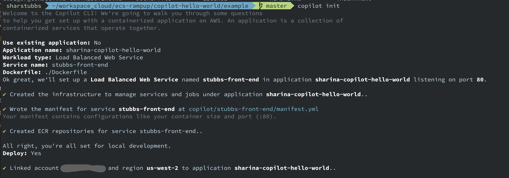

# ECS Copilot Simple Apps

## Hello World with HTTP file

Steps to deploy a first hello world app are here in the [copilot getting started documentation](https://aws.github.io/copilot-cli/docs/getting-started/first-app-tutorial/).

Default setup using `copilot init` can create a dockerfile for you. The following setup lets the app be accessible from the web.



A number of resources are deployed to support ECS during the init-stimulated setup:


The app deployed is a simple static website - frontend only.

## Hello World with Flask

A simple hello-world Flask app is used to demo Copilot.

A virtual environment was set up, using `pipenv shell` (use `exit` to get out of the virtual env't, and pipenv --rm to remove the packages but keep the code, and `psh` to launch a subshell in the vitual environment after exiting.)

Flask was installed with `pip install Flask`.

Requirements file created with `pipenv run pip freeze > requirements.txt` (while virtual environment running).

Tested the app locally:

```bash
export FLASK_APP=app.py
python -m flask run
```

Deployed the app with `copilot init` and updated it with `copilot svc deploy` when changes made in files.


About ports and exposing them:

* https://docs.docker.com/language/python/run-containers/

### Flask and Docker Documentation

* Flask quickstart - https://flask.palletsprojects.com/en/1.1.x/quickstart/
* Docker and Flask - https://docs.docker.com/language/python/build-images/

## Deployment Options

You can either build everything from scratch, including a VPC, or you can build your ECS-related resources and add them to an existing VPC.

### Create All New Resources

Deploy using the terminal, with the command `copilot init`, and follow the prompts.

Or, run the following command, which assumes knowledge of what is desired:

```bash
copilot init --app [name-of-the-application] \
  --name [name-of-the-service-or-job] \
  --type "Load Balanced Web Service" \
  --dockerfile "./Dockerfile" \
  --deploy
  ```

### Deploy Into An Already existing VPC

Run `copilot app init`, which created copilot/workspace file, and deployed a couple IAM roles into AWS.

Run `copilot env init` to create a name for the environment, ie test. It gives the option to create a new VPC etc, or import an existing VPC and subnets. It provides the VPC names from the account to choose from. A stackset is then deployed to AWS, as well as a cloudformation template with a cluster, IAM and security group resources, etc.

Run `copilot svc init` to create the manifest file and tell it where the docker file is. This is the command that creates a new service to run your code. It will also create an ECR repository for the service. Then, run `copilot svc deploy`.

You'll have one stackset and three stacks deployed in your CloudFormation console, and your command line should produce a URL to view your app.

## Add AWS CodePipeline

Copilot can build an AWS CodePipeline for your app. I used GitHub as my version control.

Make sure all the code thus far is nicely stored in a GitHub repo. Run `copilot pipeline init`, which will create a pipeline yaml file and a buildspec file for the pipeline. Then, push the updated code changes to the repo.

To deploy the resources into AWS and be prompted to set up a CodeStar Connection (unless you already added a connection to your pipeline file), run `copilot pipeline update` to build the pipeline. When you create a connection when prompted, if you need to delete a pipeline with copilot, the connection will also be conveniently deleted.

## Commands

To build it all, use `copilot init`.

To update service and resources, `copilot deploy`.


Service summary:

```bash
copilot svc show
```

List of AWS resources associated with service:

```bash
copilot svc show --resources
```

Check service status:

```bash
copilot svc status
```

Check service logs:

```bash
copilot svc logs
```

### Interact with the App

Get a list of options with `copilot app`.

List the app with `copilot app ls`. Then, plug in the name of the app you found into `copilot app show`.

Delete the AWS resources deployed in AWS (all those created from copilot init):

```bash
copilot app delete
```

### Examine the Environment

Get a list of commands with `copilot env`.

### Interact with the Front End Service

List out the commands available with `copilot svc`.

`copilot svc package` produces the CFn template for the service deployment. You'd need to do this if you wanted to start managing CFn deployments manually.

`copilot svc deploy` is the command to use when you need to locally push service changes up to the chosen environment. Once you have a pipeline setup you'd switch to the CI/CD workflow. If you update the manifest file, this is the command you use to deploy the changes to the cloud environment.

`copilot svc status` provides health and task info, and task count.

## Observations

### VPC CIDR

Copilot init will deploy a VPC before it sets up ECS if default settings are chosen. It will use CIDR 10.0.0.0/16, and if there is another VPC in the account that uses the same, it will use the CIDR regardless.

### Fargate

Copilot uses Fargate.

## Troubleshooting

### Copilot init Freezes

If `copilot init` freezes immediately after the intro statement of "Welcome to the Copilot CLI...," then this is a sign your AWS config and/or credentials file does not have a properly set up default AWS profile.

### Health Check Fails

Flask by default uses port 5000. Checking the logs shows `Running on http://10.0.0.207:5000/`, for example, using the following command.

```bash
copilot svc logs -a [application-name] -n [service-name] --follow
```

Check the Target Group port and make sure it is port 5000. This can be changed by updating the manifest file (image/port) and the dockerfile (`EXPOSE 5000`).

I have not yet determined how to tell Flask to use a different port.